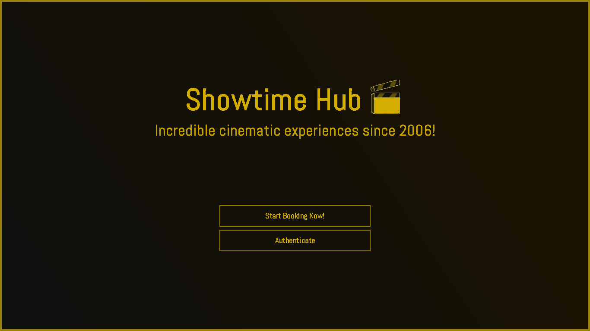
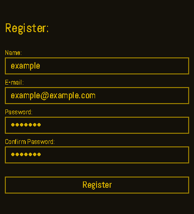
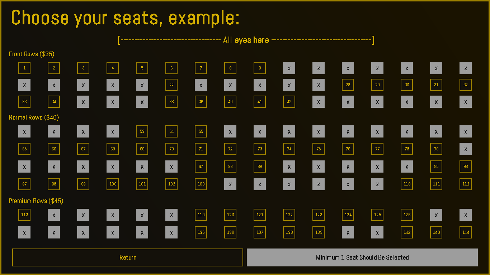
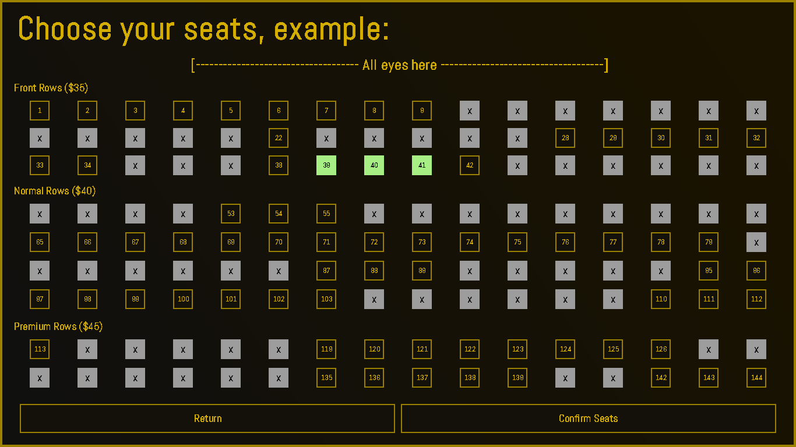
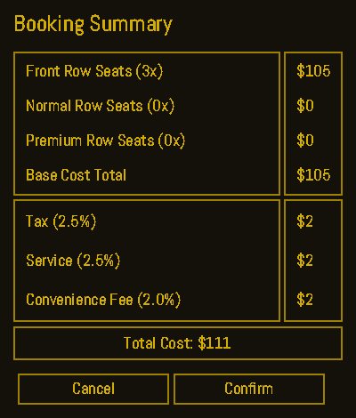
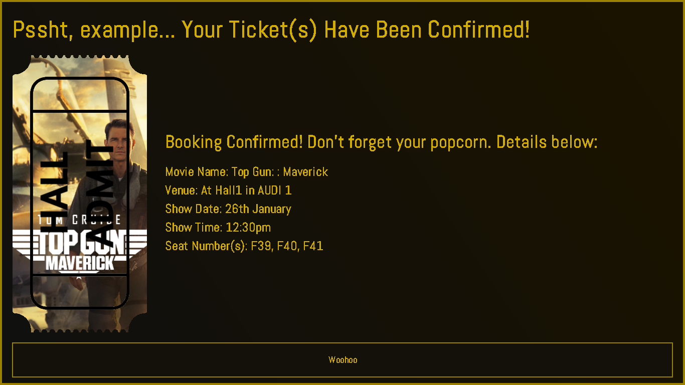

# Movie Booking Software Emulation
A simple movie booking app emulation made in pure JAVA, with default UI
libraries like JSwing and JavaAWT that comes with a stock JAVA install. Stores
data in the filesystem within .txt files.   

## Preview
<p align="center">
  
</p>  

<p align="center">
  
</p>

## Pictures with Labels
<details>
<summary>Home Screen</summary>

</details>  
  
<details>
<summary>Movie List Screen</summary>

</details>  
  
<details>
<summary>Movie Details Select</summary>

</details>  
  
<details>
<summary>Login or Registration</summary>

</details>  
  
<details>
<summary>Seat Matrix</summary>

</details>  
  
<details>
<summary>Selecting Seats</summary>

</details>  
  
<details>
<summary>Bill Summary</summary>

</details>  
  
<details>
<summary>Booking Confirmation</summary>

</details>  
  
<details>
<summary>Booking History</summary>

</details>  
  

## Problem Statement
"Build a simple TUI or GUI Movie Booking Software in either Python or JAVA using
only built-in libraries or packages that come with a base installation of the
language."

## Other Details
* Time Provided: 7 days
* Tech Stack: JAVA and stock libraries
* Result: 1st Prize
* Last Tested On: Wayland-XWayland-ArchLinux with JDK-25-temurin

## Caveats
* Uses locally stored .txt files for data storing with a hacky custom format
* Pretty sure the cancellation button on the history page does not work

## Quick Run
Go to the root folder containing the Src/ folder and run the following commands
in the terminal  
  
Using bash for this example, translate to other shells:
`NOTE`: You need to copy the sample data and assets to the compiled bin folder

```bash
mkdir Out/
javac -d Out/ @sources.txt
cp -R SampleData/ Out/Data
cp -R Src/Assets/ Out/Assets
cd Out/
java Main
```
